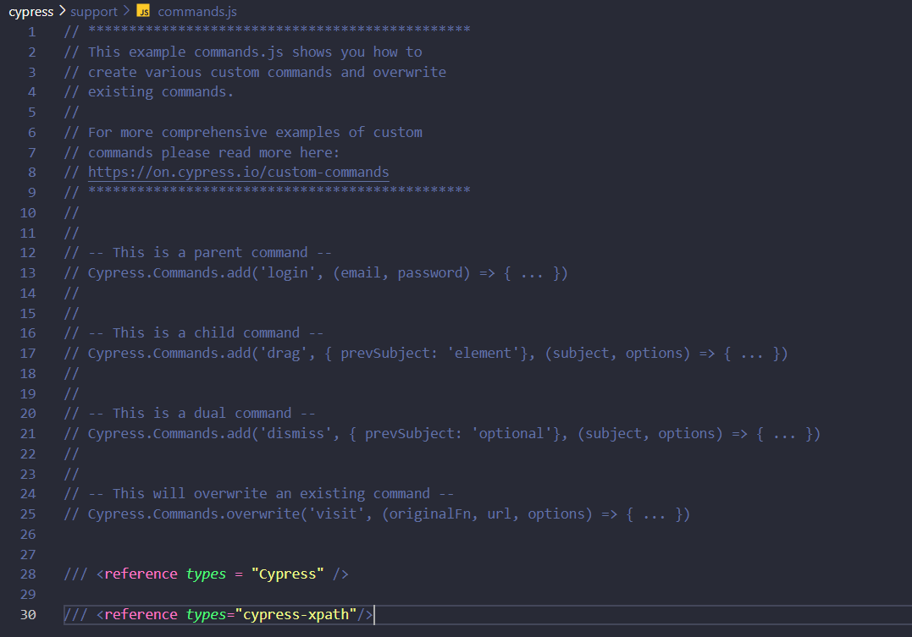
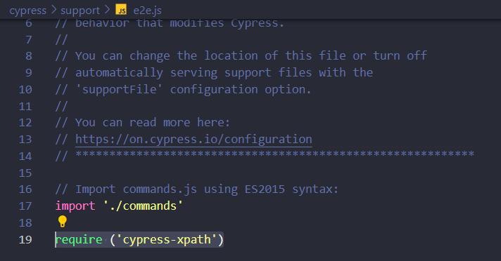

=> Cypress application open : npx cypress open

=> Cypress test case run in terminal : headless mode :
1. npx cypress run -> It will be run all the specification file (.cy.js) comming under that folder

3. Run a specific file : npx cypress run --spec Copy_Relative_Path.cy.js

=> Cypress test case run in terminal and application UI (both) : headed mode :
1. npx cypress run --headed -> It will be run all the specification file (.cy.js) comming under that folder

3. Run a specific file : npx cypress run --spec Copy_Relative_Path.cy.js --headed

4. Run in specific browser: npx cypress run --spec Copy_Relative_Path.cy.js --browser chrome --headed

5. Stop automatic browser closing: npx cypress run --spec Copy_Relative_Path.cy.js --browser chrome --headed --no-exit

=> CSS Selector : By default cypress support css selector
                : cy.get()
tag id -> #id
tag class -> .class
tag attribute - [attibute = 'value']
tag class attribute  -> tag.class[attribute = 'value']

=> Cypress XPath plugin Command : cy.xpath()
1. npm i cypress-xpath 
2. npm install -D cypress-xpath
3. navigate to supports >> commands.js >> /// <reference types="cypress-xpath"/>

4. navigate to supports >> e2e.js >> require ('cypress-xpath')

=> To call Cypress commands : navigate to supports >> commands.js >> /// <reference types = "Cypress" /> 

