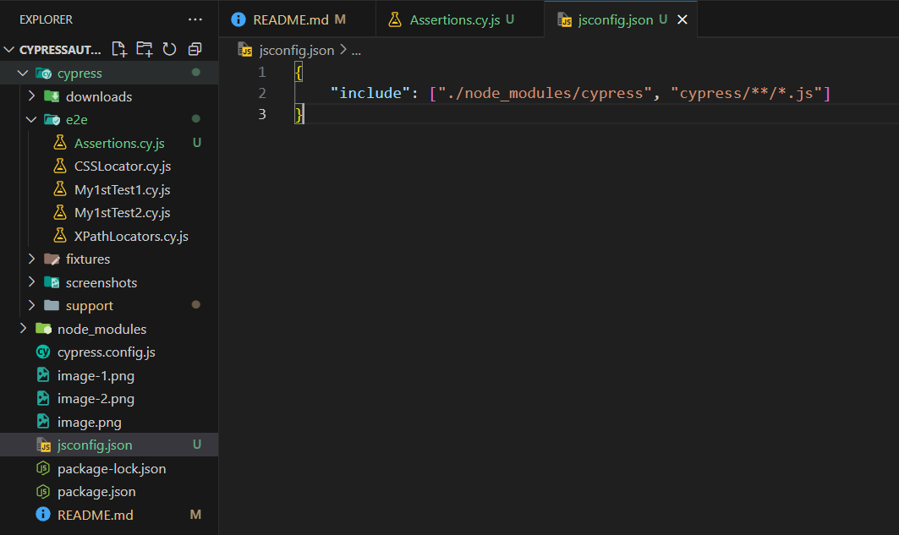

=> Cypress application open : npx cypress open

=> Cypress test case run in terminal : headless mode :
1. npx cypress run -> It will be run all the specification file (.cy.js) comming under that folder

3. Run a specific file : npx cypress run --spec Copy_Relative_Path.cy.js

=> Cypress test case run in terminal and application UI (both) : headed mode :
1. npx cypress run --headed -> It will be run all the specification file (.cy.js) comming under that folder

3. Run a specific file : npx cypress run --spec Copy_Relative_Path.cy.js --headed

4. Run in specific browser: npx cypress run --spec Copy_Relative_Path.cy.js --browser chrome --headed

5. Stop automatic browser closing: npx cypress run --spec Copy_Relative_Path.cy.js --browser chrome --headed --no-exit

=> CSS Selector : By default cypress support css selector
                : cy.get()
tag id -> #id
tag class -> .class
tag attribute - [attibute = 'value']
tag class attribute  -> tag.class[attribute = 'value']

=> Cypress XPath plugin Command : cy.xpath()
1. npm i cypress-xpath 
2. npm install -D cypress-xpath
3. navigate to supports >> commands.js >> /// <reference types="cypress-xpath"/>

4. navigate to supports >> e2e.js >> require ('cypress-xpath')

=> To call Cypress commands : 
1. navigate to supports >> commands.js >> /// <reference types = "Cypress" /> 

2. Create jsconfig.json >> 
{
    "include": ["./node_modules/cypress", "cypress/**/*.js"]
}

Cypress Assertions : 
1. Imlicit assertions / Default / Build-in assertions
A. should
B. and
> Important : eq, contain, include, exist, have.length, have.value

2. Explicit assertions
A. expect - BDD approach framework
B. assert - TDD approach framework

=> Cypress folder structure :
1. cypress >> dowanloads : we can store all dowanloaded files

2. cypress >> e2e : Main folder where we will write all specifications files

3. cypress >> fixtures : Is is use to create any static test data in .json format

4. cypress >> screenshorts : Capture screenshorts through your automation

5. cypress >> support : This basically contain reuseable script
A. commands.js : We can store or we can create customs commands. Or we can override existing commands.
B. e2e.js : This file contains some code which will load before starting your spec files

6. node_modules : Contain all cypress related module

7. cypress.config.js : This file contain cypress related configuration

8. package.json : This file contain dependencies

=> Install iframe plugin : npm install -D cypress-iframe

=> Install iframe drag and drop plugin : npm install --save-dev @4tw/cypress-drag-drop

=> File upload plugin : npm install --save-dev cypress-file-upload

